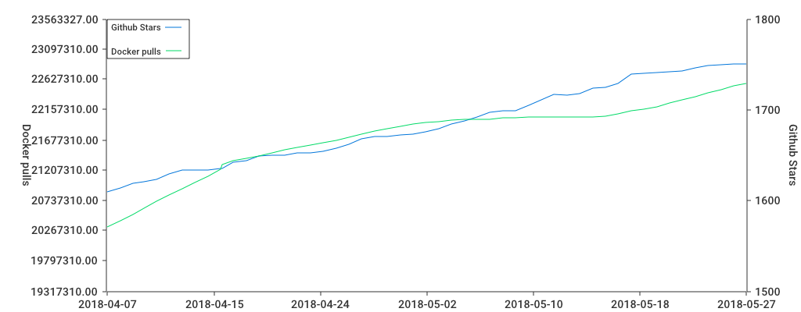
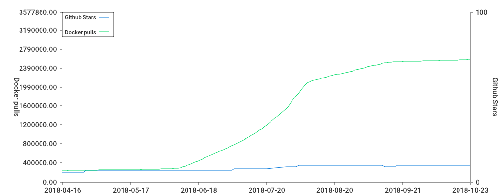

Project stats
=============

Number of stars for [https://github.com/wurstmeister/kafka-docker](https://github.com/wurstmeister/kafka-docker) over time.



```
starcatcher "https://api.github.com/repos/wurstmeister/kafka-docker" "https://hub.docker.com/v2/repositories/wurstmeister/kafka/" kafka.csv kafka.png
```

---



```
starcatcher "https://api.github.com/repos/docker-jmx-prometheus-exporter" "https://hub.docker.com/v2/repositories/sscaling/jmx-prometheus-exporter/" jmx-exporter.csv jmx-exporter.png
```
